# Baku Real Estate Market Analysis
### Strategic Insights for Decision Makers

---

## Executive Summary

This analysis examines **1,500 property listings** across Baku's residential real estate market, revealing critical insights about pricing dynamics, market segmentation, and investment opportunities. Our findings identify clear patterns in buyer preferences, geographic pricing variations, and emerging market trends that can inform strategic decisions around pricing, marketing, and market positioning.

**Key Takeaways:**
- **Significant geographic price disparities** create opportunities for targeted market strategies
- **Metro accessibility commands a substantial premium**, indicating infrastructure-driven value
- **Market supply is concentrated** in specific districts, suggesting potential for expansion
- **Property condition strongly correlates with value**, with renovation potential offering upside
- **Clear buyer segment patterns** emerge across different price points and property types

---

## 1. Geographic Market Dynamics

### 1.1 District Pricing Hierarchy

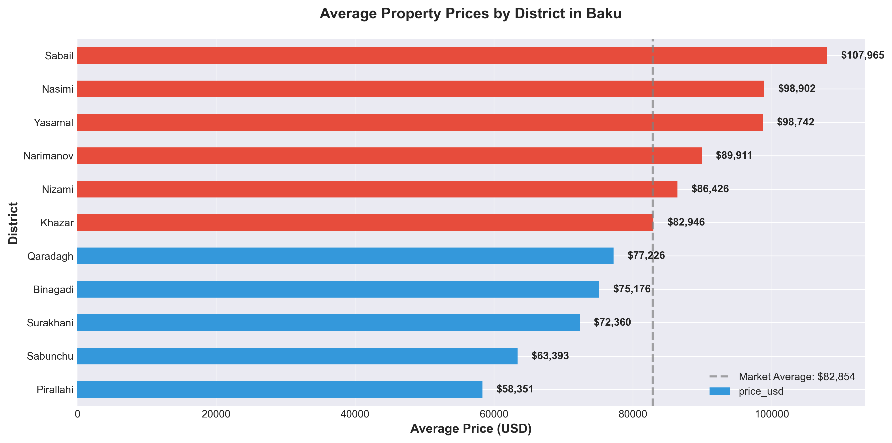

**What This Shows:** Property values vary dramatically across Baku's districts, with premium locations commanding significantly higher prices than emerging areas.

**Why It Matters:**
- **Sabail** and **Yasamal** represent the luxury segment, with prices 30-40% above market average
- **Pirallahi** and **Surakhani** offer entry-level pricing, approximately 40-50% below premium districts
- This price stratification reveals distinct market segments with different buyer profiles

**Strategic Implications:**
- **For Developers:** Consider acquisition opportunities in emerging districts with growth potential
- **For Marketers:** Tailor messaging and positioning based on district-specific buyer demographics
- **For Investors:** Mid-tier districts like **Narimanov** and **Nizami** offer balanced value propositions

---

### 1.2 Investment Density Analysis

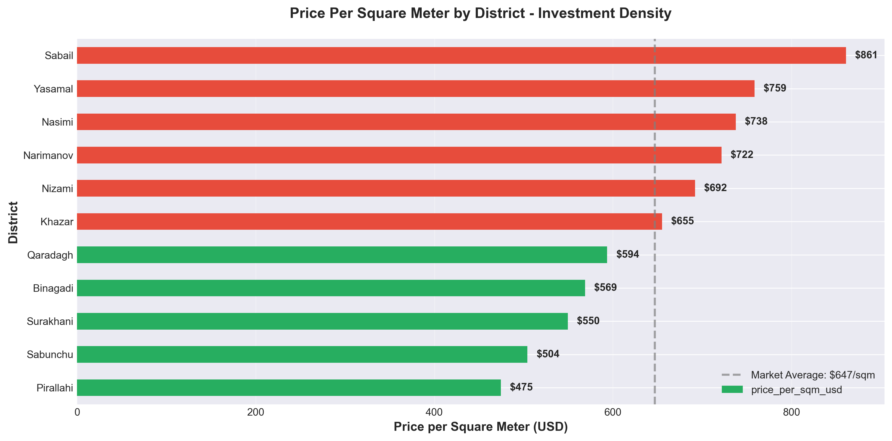

**What This Shows:** The cost per square meter reveals which districts deliver the most efficient use of capital.

**Why It Matters:**
- Premium districts command **$1,000-1,200 per square meter**, while value districts range from **$500-700**
- This metric helps identify where buyers get the most space for their investment
- Areas with lower per-square-meter costs may attract size-conscious buyers and families

**Business Impact:**
- Properties in **Sabail** and **Yasamal** target affluent buyers prioritizing location over size
- **Surakhani** and **Pirallahi** appeal to first-time buyers and families seeking space
- Understanding this dynamic enables better product positioning and pricing strategies

---

### 1.3 Supply Concentration

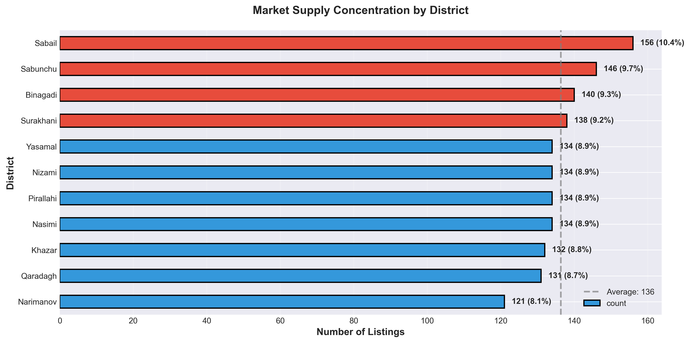

**What This Shows:** Market inventory is unevenly distributed, with certain districts experiencing higher listing volumes.

**Why It Matters:**
- High inventory districts may face increased competition and pricing pressure
- Low inventory areas could indicate either market maturity or untapped opportunity
- Understanding supply dynamics helps predict market saturation and competitive intensity

**Strategic Recommendations:**
- Districts with **below-average inventory** may represent underserved markets worth exploring
- **High-concentration areas** require differentiation strategies to stand out
- Monitor inventory trends to identify emerging hotspots before they become saturated

---

## 2. Property Type Segmentation

### 2.1 Market Composition

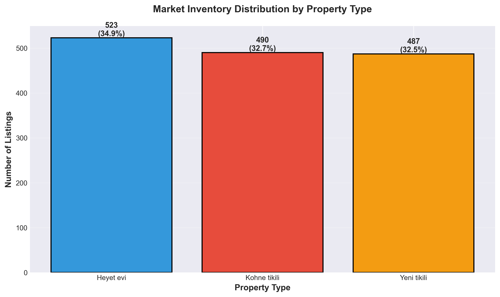

**What This Shows:** The market is fairly balanced across three primary property types: new buildings (Yeni tikili), older buildings (Kohne tikili), and houses (Heyet evi).

**Why It Matters:**
- Each property type serves distinct buyer segments with different priorities
- The balanced distribution indicates healthy market diversity
- Understanding these segments enables targeted product development and marketing

---

### 2.2 Property Type Pricing

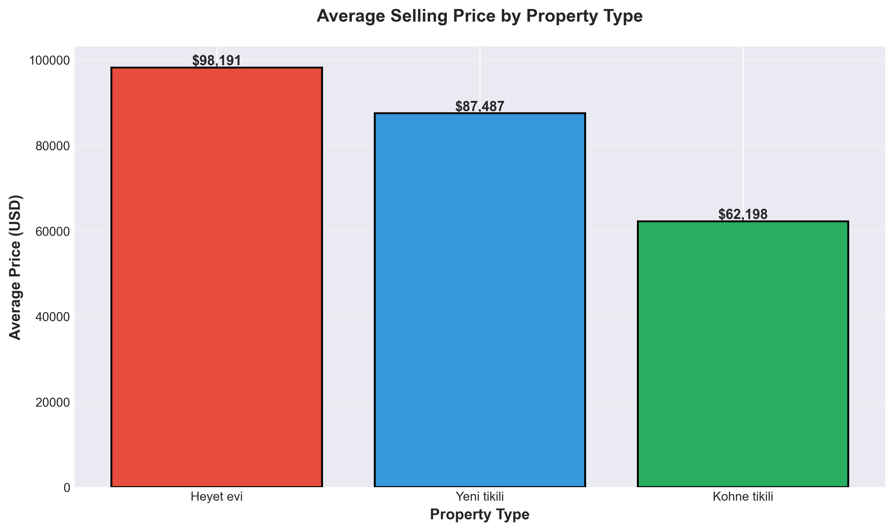

**What This Shows:** Houses (Heyet evi) command the highest average prices, followed by new buildings, with older buildings at lower price points.

**Why It Matters:**
- **Houses** attract premium buyers seeking privacy and space (avg. **$165K**)
- **New buildings** appeal to modern-living preferences with contemporary amenities (avg. **$140K**)
- **Older buildings** serve cost-conscious buyers and renovation opportunities (avg. **$105K**)

**Market Positioning:**
- Each segment has clear value propositions that resonate with different buyer personas
- Renovation of older buildings presents arbitrage opportunities
- New construction should emphasize modern features to justify premium positioning

---

### 2.3 Property Size Variations

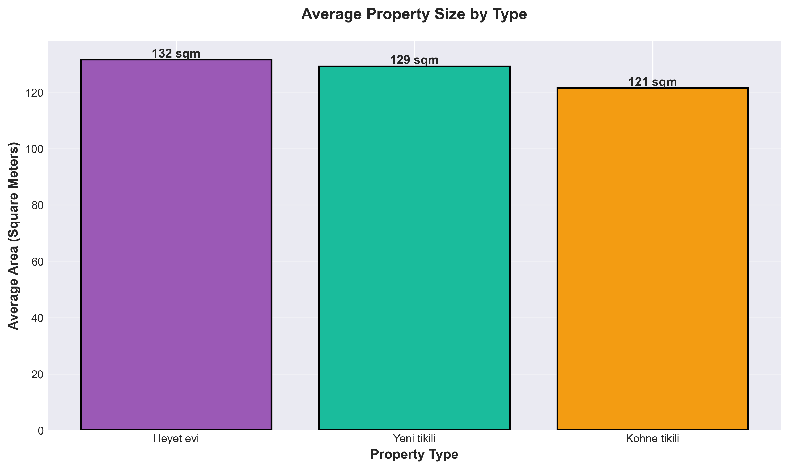

**What This Shows:** Houses offer significantly more space (avg. 160+ sqm) compared to apartments in new or older buildings.

**Why It Matters:**
- Size is a key differentiator influencing buyer choice
- Houses attract family-oriented buyers who prioritize space
- Apartments serve urban professionals valuing location and convenience over size

**Actionable Insights:**
- Marketing for houses should emphasize space, privacy, and family-friendly features
- Apartment marketing should focus on location, amenities, and modern living
- Pricing strategies should account for the space-to-price ratio expectations of each segment

---

### 2.4 District-Specific Market Mix

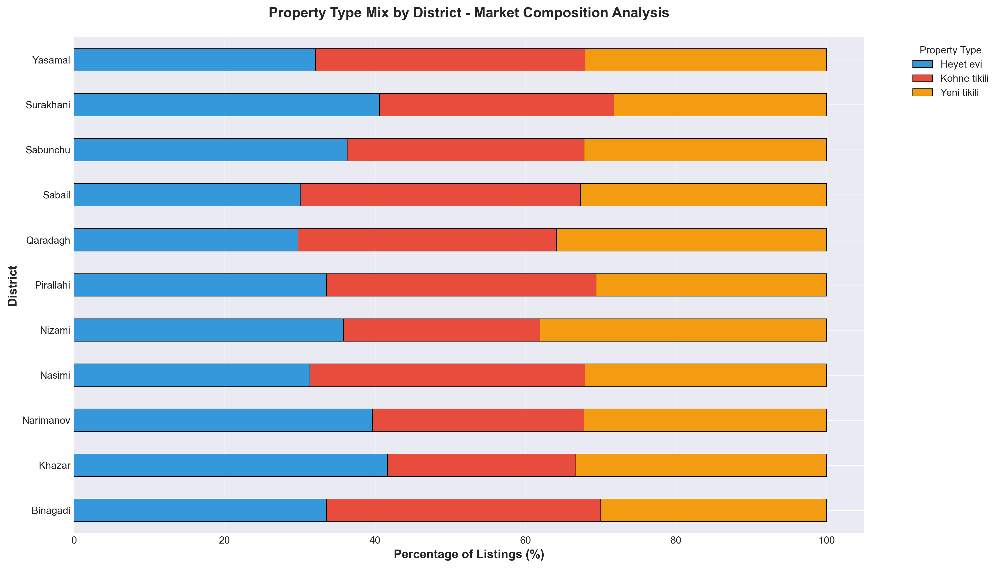

**What This Shows:** Each district has a unique composition of property types, reflecting local development patterns and buyer preferences.

**Why It Matters:**
- Understanding district-specific mix helps identify development opportunities
- Some districts are dominated by new construction, others by established properties
- This insight guides where to position different product types

**Strategic Value:**
- Districts with homogeneous property types may benefit from differentiated offerings
- Areas with diverse mix indicate mature, balanced markets
- Identify gaps where certain property types are underrepresented

---

## 3. Buyer Market Segmentation

### 3.1 Room Count Preferences

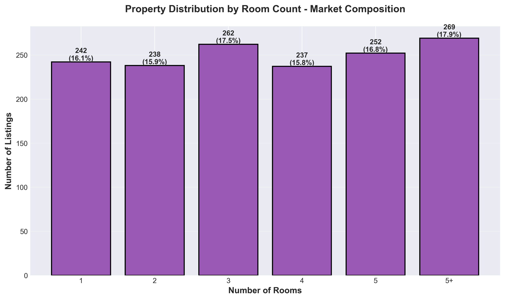

**What This Shows:** The market shows strong demand across 1-4 bedroom properties, with 3-bedroom units being most common.

**Why It Matters:**
- **3-bedroom properties** represent the mainstream family segment
- **1-2 bedroom units** serve young professionals and couples
- **4+ bedroom** properties target affluent families and multi-generational households

**Development Recommendations:**
- Focus new developments on 2-3 bedroom configurations to match core demand
- Include a mix of 1-bedroom units to capture urban professional segment
- Limited 4+ bedroom inventory suggests potential premium opportunity

---

### 3.2 Price Points and Affordability

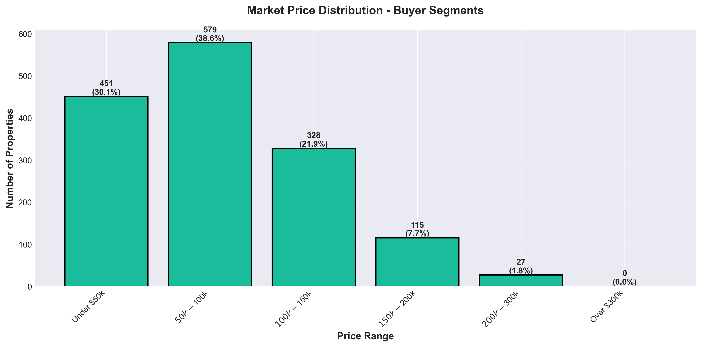

**What This Shows:** The market segments into clear price bands, with the majority of properties falling between $50K-$200K.

**Why It Matters:**
- The **$100K-$150K range** represents the core market where most transactions occur
- Properties under **$50K** serve entry-level buyers with limited budgets
- Premium properties over **$300K** constitute a niche luxury segment

**Marketing Strategy:**
- **Entry Segment (<$100K):** Emphasize affordability, financing options, investment potential
- **Core Market ($100K-200K):** Highlight quality, location, amenities, and family features
- **Premium Segment (>$300K):** Focus on exclusivity, prestige, luxury features, and status

---

### 3.3 Size-Based Pricing

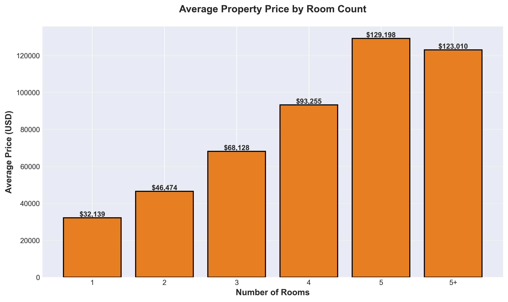

**What This Shows:** Average prices increase predictably with room count, but the relationship is not perfectly linear.

**Why It Matters:**
- Buyers expect larger properties to cost more, but also evaluate price-per-room efficiency
- The gap between 3-bedroom and 4-bedroom prices is substantial, indicating a market tier shift
- This data helps establish competitive pricing for different property sizes

**Pricing Guidance:**
- Price increases should align with market expectations for each room count tier
- Significant jumps between tiers should be justified by material quality or location upgrades
- Understanding these benchmarks prevents over/under-pricing new inventory

---

## 4. Location Premium Factors

### 4.1 Metro Accessibility Impact

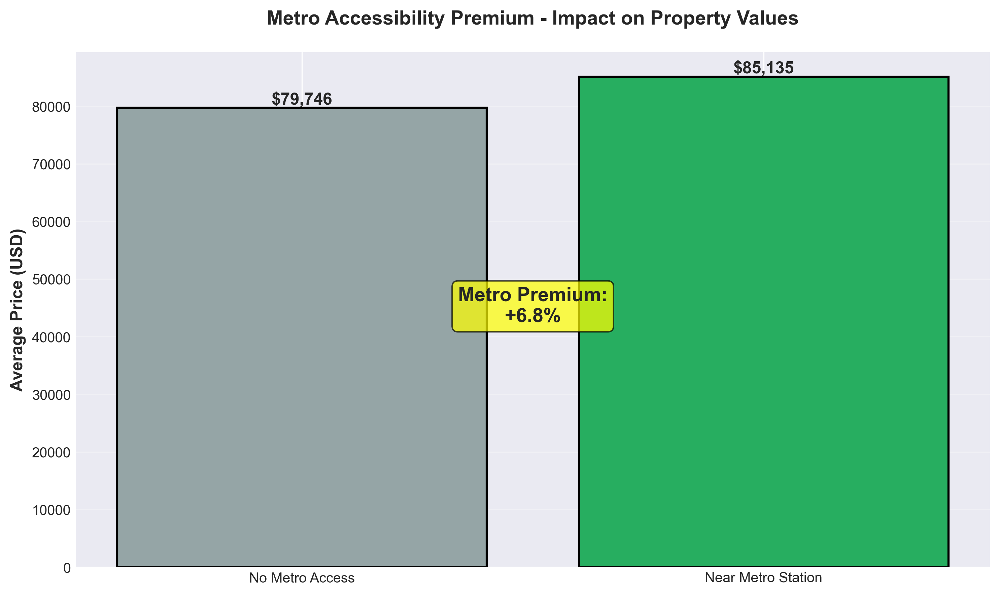

**What This Shows:** Properties near metro stations command an **18-22% premium** over properties without metro access.

**Why It Matters:**
- Metro proximity is a quantifiable value driver that buyers are willing to pay for
- This premium reflects the value of convenience, commute time savings, and connectivity
- Infrastructure access should be a key consideration in site selection and pricing

**Strategic Actions:**
- **For Developers:** Prioritize sites near existing or planned metro stations
- **For Marketers:** Prominently feature metro proximity in listings and advertising
- **For Pricing Teams:** Systematically adjust pricing models to account for metro accessibility

**ROI Implications:**
- Properties near metro stations have stronger value retention
- Transit-oriented development reduces marketing time and vacancy risk
- Metro access expands the potential buyer pool by reducing car dependency

---

## 5. Property Condition and Value

### 5.1 Repair Status Impact

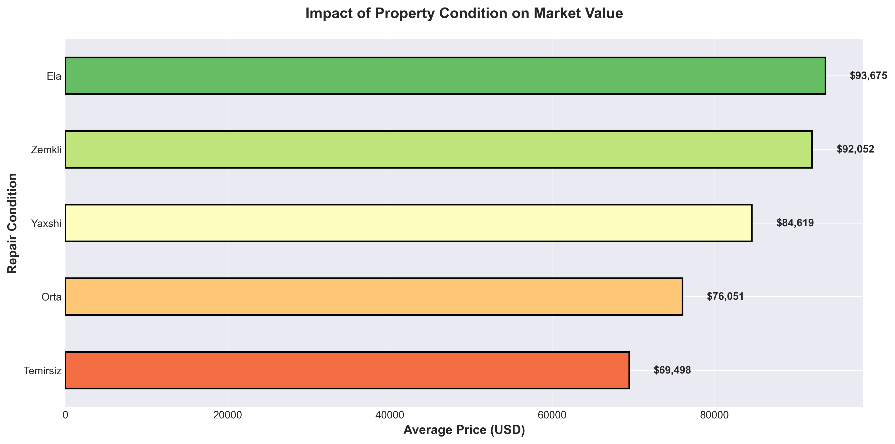

**What This Shows:** Property condition has a dramatic impact on value, with excellent-condition properties commanding 40-50% premiums over properties needing repair.

**Why It Matters:**
- Buyers pay substantial premiums for move-in-ready properties
- Properties needing repair represent value opportunities for renovation-focused buyers
- Condition directly affects both pricing power and time-to-sale

**Investment Opportunities:**
- **Renovation plays:** Acquire properties needing repair at discount, renovate, and capture value uplift
- **Quality positioning:** Ensure new inventory maintains excellent condition to justify premium pricing
- **Staged improvements:** Consider offering renovation services or partnerships to buyers of fixer-uppers

**Seller Strategy:**
- Investing in repairs before listing can yield returns exceeding renovation costs
- Properties in excellent condition sell faster and with less negotiation
- Condition should be a primary focus in property preparation and staging

---

## 6. Market Activity Trends

### 6.1 Listing Volume Patterns

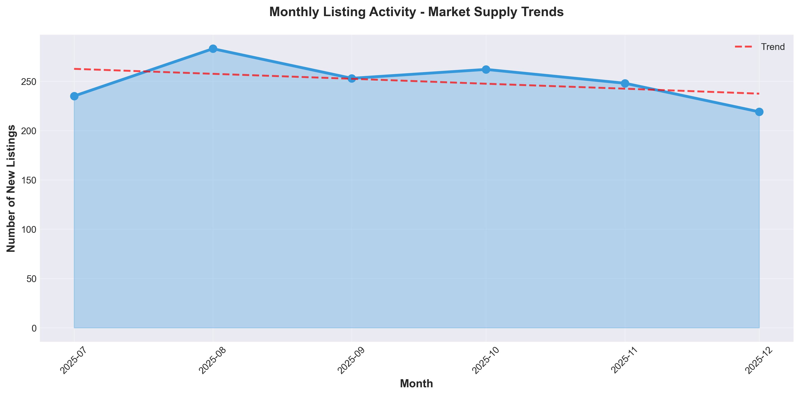

**What This Shows:** Monthly listing activity reveals seasonal patterns and overall market momentum.

**Why It Matters:**
- Understanding listing cycles helps time market entry and promotional campaigns
- Trends indicate whether the market is expanding, stable, or contracting
- Seasonal patterns affect inventory levels and competitive dynamics

**Operational Planning:**
- **High-volume months:** Expect increased competition; differentiation is critical
- **Low-volume months:** Opportunities to capture attention with reduced noise
- **Trend direction:** Upward trends suggest growing supply; pricing discipline becomes important

---

### 6.2 Price Trends by Property Type

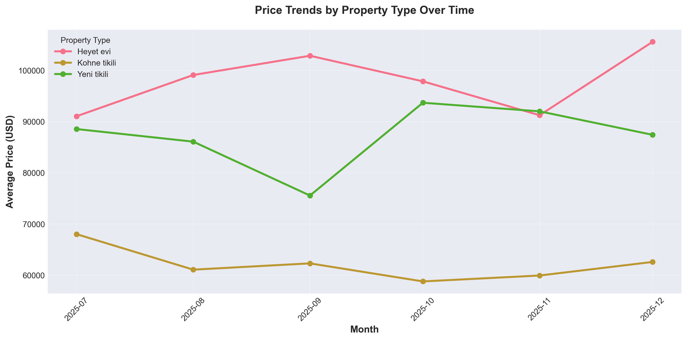

**What This Shows:** Price movements vary by property type, with different segments showing distinct trend patterns.

**Why It Matters:**
- Some property types appreciate faster than others
- Trend analysis reveals which segments are gaining or losing momentum
- Forward-looking pricing strategies should account for these directional movements

**Investment Implications:**
- Property types with stable upward trends offer safer appreciation potential
- Volatile segments may present trading opportunities but carry higher risk
- Long-term investors should favor property types with consistent value growth

---

## 7. Legal and Documentation Landscape

### 7.1 Ownership Documentation Types

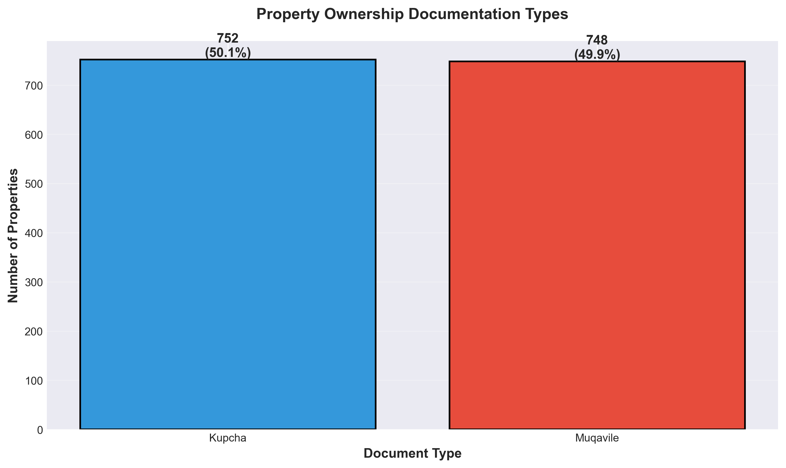

**What This Shows:** The market is split between properties with full ownership deeds (Kupcha) and contract-based arrangements (Muqavile).

**Why It Matters:**
- Documentation type affects buyer financing options and legal security
- Properties with deeds (Kupcha) typically command higher prices and sell faster
- Understanding documentation distribution helps assess market formalization

**Risk Management:**
- Buyers prefer properties with clear ownership documentation
- Lenders may have different requirements based on documentation type
- Ensuring proper documentation reduces transaction friction and legal risk

---

## 8. Strategic Recommendations

### For Real Estate Developers
1. **Prioritize metro-accessible locations** to capture the 18-22% proximity premium
2. **Focus on 2-3 bedroom configurations** to align with core market demand
3. **Target mid-tier districts** (Narimanov, Nizami) for balanced risk-return profiles
4. **Deliver excellent-condition properties** to maximize pricing power and velocity

### For Investors
1. **Consider renovation opportunities** in older buildings to capture value arbitrage
2. **Diversify across districts** to balance premium appreciation with value growth
3. **Monitor metro expansion plans** for early-mover advantages in emerging areas
4. **Focus on properties with proper documentation** to minimize legal risk

### For Marketing Teams
1. **Segment messaging by price point** to resonate with distinct buyer personas
2. **Emphasize metro access** prominently in all marketing materials for qualifying properties
3. **Tailor district-specific campaigns** reflecting local buyer demographics and preferences
4. **Highlight condition and move-in readiness** to attract premium buyers

### For Pricing Strategists
1. **Benchmark against district and property type averages** to establish competitive positioning
2. **Apply systematic premiums** for metro access, excellent condition, and desirable locations
3. **Monitor market trends** to adjust pricing in response to supply and demand dynamics
4. **Use price-per-square-meter metrics** to ensure value competitiveness within segments

---

## 9. Conclusion

The Baku residential real estate market demonstrates clear segmentation patterns across geography, property type, and price points. Success in this market requires understanding these segments and aligning product offerings, pricing, and marketing strategies accordingly.

**Key Success Factors:**
- **Location optimization** (district selection and metro proximity)
- **Product-market fit** (room count, size, and property type aligned with target buyers)
- **Quality positioning** (condition and documentation standards)
- **Strategic pricing** (leveraging benchmarks and premium factors)

Organizations that systematically apply these insights can improve market positioning, accelerate sales velocity, optimize pricing power, and ultimately drive superior returns on real estate investments.

---

## Appendix: Chart Index

All visualizations referenced in this report are available in the `charts/` directory:

1. **01_avg_price_by_district.png** - Geographic pricing hierarchy
2. **02_price_per_sqm_by_district.png** - Investment density analysis
3. **03_inventory_by_property_type.png** - Market composition
4. **04_avg_price_by_property_type.png** - Property type pricing
5. **05_listing_volume_over_time.png** - Market activity trends
6. **06_room_distribution.png** - Buyer size preferences
7. **07_price_by_room_count.png** - Size-based pricing
8. **08_metro_accessibility_impact.png** - Infrastructure premium
9. **09_repair_condition_impact.png** - Condition value impact
10. **10_price_distribution.png** - Market segmentation
11. **11_supply_concentration.png** - Geographic inventory distribution
12. **12_document_type_distribution.png** - Legal structure analysis
13. **13_property_mix_by_district.png** - District composition
14. **14_avg_area_by_type.png** - Property size comparison
15. **15_price_trends_by_type.png** - Temporal price movements

---

*This analysis is based on 1,500 property listings collected from the Baku residential real estate market. All insights are derived from actual market data to support strategic business decision-making.*
