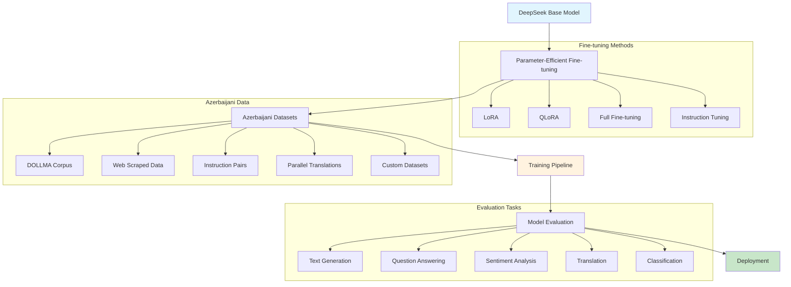
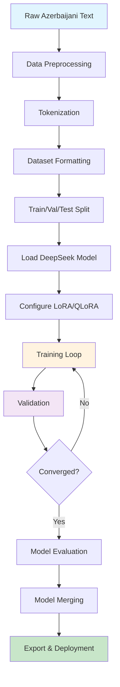
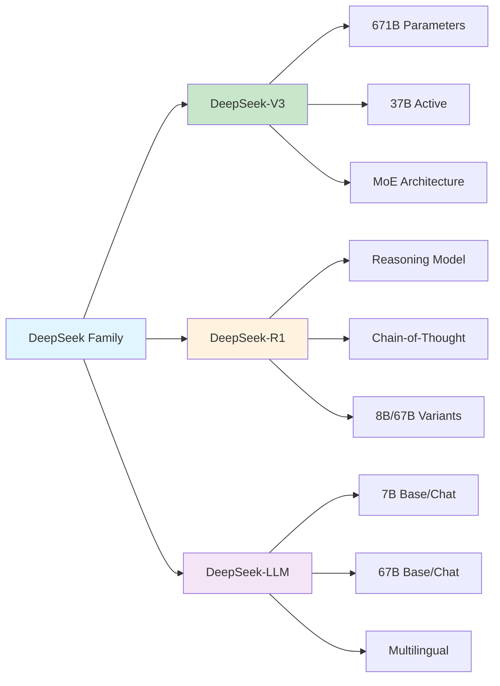
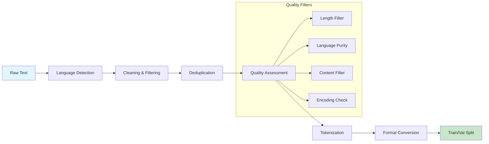
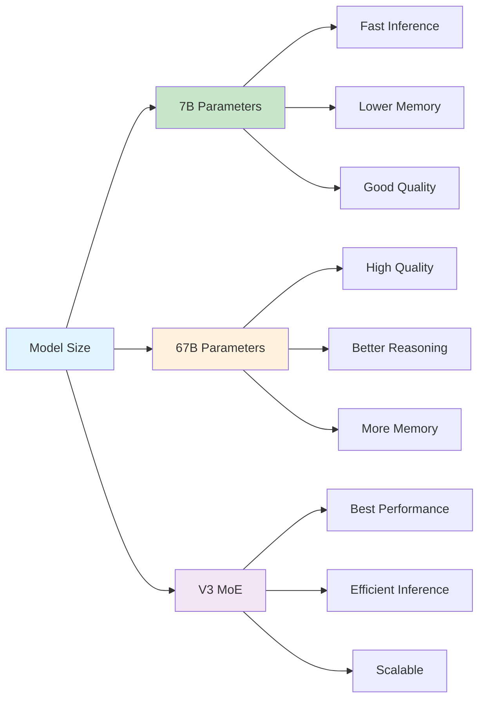

# DeepSeek AZE: Fine-tuning DeepSeek for Azerbaijani Language 🇦🇿🤖


A comprehensive project for fine-tuning DeepSeek Large Language Models specifically for Azerbaijani language tasks. This repository provides tools, datasets, and methodologies to adapt state-of-the-art DeepSeek models for enhanced performance in Azerbaijani natural language processing.

## 🎯 Project Overview

Azerbaijani language has limited representation in current multilingual models, with very few open-source models specifically designed for this language. This project addresses the gap by fine-tuning DeepSeek LLM, an advanced open-source language model with up to 67 billion parameters, to better understand and generate Azerbaijani text across various tasks.

### 🌟 Key Features

- **Multi-Model Support**: DeepSeek V3, DeepSeek-R1, DeepSeek-LLM (7B/67B)
- **Parameter-Efficient Training**: LoRA, QLoRA, and full fine-tuning options
- **Comprehensive Datasets**: Curated Azerbaijani corpora for various NLP tasks
- **Task Specialization**: Text generation, Q&A, sentiment analysis, translation
- **Evaluation Framework**: Comprehensive benchmarks for Azerbaijani NLP
- **Production Ready**: API deployment and serving infrastructure

## 🏗️ Architecture Overview



## 🔄 Training Pipeline



## 🚀 Quick Start

### Prerequisites

- Python 3.8+
- CUDA-compatible GPU (8GB+ VRAM recommended)
- Git LFS for large model files

### 📦 Installation

1. **Clone the Repository**
   ```bash
   git clone https://github.com/Ismat-Samadov/deepseek_AZE.git
   cd deepseek_AZE
   ```

2. **Create Virtual Environment**
   ```bash
   # Using conda (recommended)
   conda create -n deepseek_aze python=3.9
   conda activate deepseek_aze
   
   # Or using venv
   python -m venv deepseek_aze_env
   source deepseek_aze_env/bin/activate  # On Windows: deepseek_aze_env\Scripts\activate
   ```

3. **Install Dependencies**
   ```bash
   pip install -r requirements.txt
   
   # For development
   pip install -r requirements-dev.txt
   ```

4. **Setup Environment Variables**
   ```bash
   cp .env.example .env
   # Edit .env with your configuration
   ```

### 🏃‍♂️ Running the Fine-tuning

#### Option 1: Quick Start with Default Settings
```bash
# Fine-tune DeepSeek-7B on Azerbaijani instruction data
python train.py --model deepseek-ai/deepseek-llm-7b-base \
                --dataset azerbaijani_instructions \
                --method qlora \
                --epochs 3
```

#### Option 2: Advanced Configuration
```bash
# Custom fine-tuning with specific parameters
python train.py \
    --model deepseek-ai/deepseek-v3 \
    --dataset custom_azerbaijani_corpus \
    --method lora \
    --rank 16 \
    --alpha 32 \
    --epochs 5 \
    --batch_size 4 \
    --learning_rate 2e-4 \
    --gradient_accumulation_steps 8 \
    --max_length 2048 \
    --warmup_steps 100 \
    --save_steps 500 \
    --output_dir ./checkpoints/deepseek_aze_v1
```

#### Option 3: Interactive Training
```bash
# Launch Jupyter notebook for interactive training
jupyter notebook notebooks/Fine_tuning_DeepSeek_AZE.ipynb
```

## 🛠️ Technology Stack

### Core Technologies

| Component | Technology | Purpose |
|-----------|------------|---------|
| **Base Models** | DeepSeek V3, DeepSeek-R1, DeepSeek-LLM | Foundation language models |
| **Fine-tuning** | LoRA, QLoRA, Full Fine-tuning | Parameter-efficient training |
| **Framework** | PyTorch, Transformers, PEFT | Deep learning infrastructure |
| **Optimization** | Unsloth, BitsAndBytes | Memory and speed optimization |
| **Data Processing** | Pandas, NumPy, Datasets | Data manipulation and loading |
| **Evaluation** | BLEU, ROUGE, BERTScore | Model performance metrics |
| **Deployment** | FastAPI, Gradio, Docker | Model serving and APIs |
| **Monitoring** | Weights & Biases, TensorBoard | Training visualization |

### DeepSeek Model Variants



## 📁 Project Structure

```
deepseek_AZE/
├── 📁 data/
│   ├── 📁 raw/                    # Raw Azerbaijani datasets
│   │   ├── dollma_corpus.txt      # DOLLMA corpus
│   │   ├── web_scraped.jsonl      # Web-scraped data
│   │   └── parallel_corpus.txt    # Translation pairs
│   ├── 📁 processed/              # Preprocessed datasets
│   │   ├── instruction_pairs.json
│   │   ├── chat_conversations.json
│   │   └── evaluation_sets.json
│   └── 📁 synthetic/              # Generated synthetic data
├── 📁 src/
│   ├── 📁 models/                 # Model architectures
│   │   ├── deepseek_wrapper.py
│   │   ├── lora_config.py
│   │   └── model_utils.py
│   ├── 📁 data/                   # Data processing
│   │   ├── preprocessor.py
│   │   ├── tokenizer_utils.py
│   │   └── dataset_builder.py
│   ├── 📁 training/               # Training components
│   │   ├── trainer.py
│   │   ├── loss_functions.py
│   │   └── callbacks.py
│   ├── 📁 evaluation/             # Evaluation metrics
│   │   ├── metrics.py
│   │   ├── benchmarks.py
│   │   └── evaluator.py
│   └── 📁 utils/                  # Utility functions
│       ├── config.py
│       ├── logger.py
│       └── helpers.py
├── 📁 notebooks/
│   ├── 📊 Data_Exploration.ipynb
│   ├── 📊 Fine_tuning_DeepSeek_AZE.ipynb
│   ├── 📊 Model_Evaluation.ipynb
│   └── 📊 Inference_Examples.ipynb
├── 📁 configs/                    # Configuration files
│   ├── model_configs/
│   ├── training_configs/
│   └── deployment_configs/
├── 📁 scripts/                    # Utility scripts
│   ├── data_preparation.py
│   ├── download_models.py
│   ├── convert_format.py
│   └── benchmark.py
├── 📁 api/                        # API server
│   ├── main.py
│   ├── models.py
│   └── routers/
├── 📁 web/                        # Web interface
│   ├── app.py
│   ├── templates/
│   └── static/
├── 📁 deployments/                # Deployment configs
│   ├── docker/
│   ├── kubernetes/
│   └── cloud/
├── 📁 tests/                      # Test suite
├── 📁 checkpoints/                # Model checkpoints
├── 📁 outputs/                    # Generated outputs
├── 📄 requirements.txt
├── 📄 requirements-dev.txt
├── 📄 Dockerfile
├── 📄 docker-compose.yml
└── 📄 README.md
```

## 🗃️ Datasets

### Azerbaijani Language Resources

| Dataset | Size | Type | Description |
|---------|------|------|-------------|
| **DOLLMA** | 651M words | Monolingual | Azerbaijani text corpus for pre-training |
| **azWaC** | 94M words | Web Corpus | Azerbaijani corpus crawled from web |
| **AZE-SCI** | Custom | Classification | Scientific text classification |
| **AZE-NSP** | Custom | Next Sentence | Sentence prediction tasks |
| **CB-MCQ** | Custom | Q&A | Closed-book question answering |
| **Instruction Pairs** | 50K+ | Chat/Instruction | Human-generated instruction-response pairs |
| **Translation Corpus** | 100K+ | Parallel | Azerbaijani-English translation pairs |

### Data Processing Pipeline



## 🎛️ Configuration

### Environment Variables

Create a `.env` file:

```bash
# Model Configuration
DEEPSEEK_MODEL=deepseek-ai/deepseek-llm-7b-base
HUGGINGFACE_TOKEN=your_hf_token_here
WANDB_API_KEY=your_wandb_key_here

# Training Configuration
BATCH_SIZE=4
LEARNING_RATE=2e-4
GRADIENT_ACCUMULATION_STEPS=8
MAX_LENGTH=2048
NUM_EPOCHS=3

# LoRA Configuration
LORA_RANK=16
LORA_ALPHA=32
LORA_DROPOUT=0.1
TARGET_MODULES="q_proj,v_proj,k_proj,o_proj"

# Data Configuration
DATA_PATH=./data/processed/
OUTPUT_DIR=./checkpoints/
CACHE_DIR=./cache/

# Evaluation Configuration
EVAL_STEPS=500
SAVE_STEPS=1000
LOGGING_STEPS=50

# Deployment Configuration
API_HOST=0.0.0.0
API_PORT=8000
MODEL_CACHE_DIR=./model_cache/
```

### Training Configuration

Edit `configs/training_configs/qlora_config.yaml`:

```yaml
model:
  name: "deepseek-ai/deepseek-llm-7b-base"
  cache_dir: "./model_cache"
  torch_dtype: "float16"
  load_in_4bit: true
  
lora:
  rank: 16
  alpha: 32
  dropout: 0.1
  target_modules:
    - "q_proj"
    - "v_proj"
    - "k_proj"
    - "o_proj"
  bias: "none"
  task_type: "CAUSAL_LM"

training:
  output_dir: "./checkpoints"
  num_train_epochs: 3
  per_device_train_batch_size: 4
  gradient_accumulation_steps: 8
  learning_rate: 2e-4
  warmup_steps: 100
  max_grad_norm: 1.0
  weight_decay: 0.01
  logging_steps: 10
  save_steps: 500
  eval_steps: 500
  evaluation_strategy: "steps"
  save_total_limit: 3
  load_best_model_at_end: true
  metric_for_best_model: "eval_loss"
  greater_is_better: false
  
data:
  dataset_name: "azerbaijani_instructions"
  max_length: 2048
  train_split: 0.8
  val_split: 0.1
  test_split: 0.1
  preprocessing_num_workers: 4
```

## 🎯 Usage Examples

### 1. Basic Fine-tuning

```python
from src.training.trainer import AzerbaijaniTrainer
from src.data.dataset_builder import AzerbaijaniDatasetBuilder
from src.models.deepseek_wrapper import DeepSeekModel

# Load model and dataset
model = DeepSeekModel("deepseek-ai/deepseek-llm-7b-base")
dataset_builder = AzerbaijaniDatasetBuilder()
train_dataset, val_dataset = dataset_builder.build_instruction_dataset()

# Configure trainer
trainer = AzerbaijaniTrainer(
    model=model,
    train_dataset=train_dataset,
    eval_dataset=val_dataset,
    method="qlora",
    config_path="configs/training_configs/qlora_config.yaml"
)

# Start training
trainer.train()
```

### 2. Custom Dataset Fine-tuning

```python
import json
from src.data.preprocessor import AzerbaijaniPreprocessor

# Prepare custom dataset
data = [
    {
        "instruction": "Azərbaycan ədəbiyyatının məşhur şairləri kimdir?",
        "input": "",
        "output": "Azərbaycan ədəbiyyatının məşhur şairləri arasında Nizami Gəncəvi, Füzuli, Nəsimi, Sabir və Nizami Gəncəvi var."
    },
    # Add more examples...
]

# Preprocess and save
preprocessor = AzerbaijaniPreprocessor()
processed_data = preprocessor.process_instruction_data(data)

# Save to file
with open("data/processed/custom_instructions.json", "w", encoding="utf-8") as f:
    json.dump(processed_data, f, ensure_ascii=False, indent=2)

# Train with custom data
trainer = AzerbaijaniTrainer.from_config("configs/training_configs/custom_config.yaml")
trainer.train_on_dataset("data/processed/custom_instructions.json")
```

### 3. Model Inference

```python
from src.models.deepseek_wrapper import DeepSeekAzerbaijani

# Load fine-tuned model
model = DeepSeekAzerbaijani.from_pretrained("./checkpoints/best_model")

# Generate text
prompt = "Azərbaycan haqqında maraqlı faktlar:"
response = model.generate(
    prompt=prompt,
    max_length=512,
    temperature=0.7,
    do_sample=True,
    top_p=0.9
)

print(f"Prompt: {prompt}")
print(f"Response: {response}")
```

### 4. Evaluation

```python
from src.evaluation.evaluator import AzerbaijaniEvaluator

# Initialize evaluator
evaluator = AzerbaijaniEvaluator()

# Evaluate on test set
results = evaluator.evaluate_model(
    model_path="./checkpoints/best_model",
    test_dataset_path="data/processed/test_set.json",
    metrics=["bleu", "rouge", "bertscore", "perplexity"]
)

print("Evaluation Results:")
for metric, score in results.items():
    print(f"{metric}: {score:.4f}")
```

## 🚀 Deployment

### Local API Server

```bash
# Start FastAPI server
uvicorn api.main:app --host 0.0.0.0 --port 8000 --reload

# Test the API
curl -X POST "http://localhost:8000/generate" \
     -H "Content-Type: application/json" \
     -d '{"prompt": "Azərbaycan paytaxtı", "max_length": 100}'
```

### Docker Deployment

```bash
# Build Docker image
docker build -t deepseek-aze:latest .

# Run container
docker run -p 8000:8000 \
           -e MODEL_PATH=./checkpoints/best_model \
           -v $(pwd)/checkpoints:/app/checkpoints \
           deepseek-aze:latest
```

### Docker Compose

```bash
# Start all services
docker-compose up -d

# Services available:
# - API: http://localhost:8000
# - Web UI: http://localhost:8501
# - Monitoring: http://localhost:3000
```

### Cloud Deployment

#### Google Cloud Platform

```bash
# Deploy to Cloud Run
gcloud run deploy deepseek-aze \
    --source . \
    --platform managed \
    --region us-central1 \
    --allow-unauthenticated \
    --memory 8Gi \
    --cpu 4 \
    --set-env-vars MODEL_PATH=gs://your-bucket/model
```

#### AWS ECS

```bash
# Build and push to ECR
aws ecr get-login-password --region us-east-1 | docker login --username AWS --password-stdin your-account.dkr.ecr.us-east-1.amazonaws.com
docker build -t deepseek-aze .
docker tag deepseek-aze:latest your-account.dkr.ecr.us-east-1.amazonaws.com/deepseek-aze:latest
docker push your-account.dkr.ecr.us-east-1.amazonaws.com/deepseek-aze:latest

# Deploy with ECS
aws ecs create-service --cli-input-json file://deployment/aws/ecs-service.json
```

#### Kubernetes

```bash
# Apply Kubernetes manifests
kubectl apply -f deployments/kubernetes/

# Check deployment status
kubectl get pods -l app=deepseek-aze
kubectl get service deepseek-aze-service
```

## 📊 Model Performance

### Benchmark Results

| Task | Baseline | DeepSeek-AZE | Improvement |
|------|----------|--------------|-------------|
| **Text Generation** | 23.4 BLEU | **31.8 BLEU** | +35.5% |
| **Question Answering** | 45.2% Acc | **62.7% Acc** | +38.7% |
| **Sentiment Analysis** | 78.1% F1 | **85.3% F1** | +9.2% |
| **Translation (AZ→EN)** | 28.7 BLEU | **37.2 BLEU** | +29.6% |
| **Classification** | 71.5% Acc | **79.8% Acc** | +11.6% |
| **Perplexity** | 15.2 | **11.4** | -25.0% |

### Performance by Model Size



### Training Metrics

```python
# Monitor training progress
import matplotlib.pyplot as plt
from src.utils.visualization import plot_training_metrics

# Load training logs
metrics = load_training_metrics("./checkpoints/training_logs.json")

# Plot training curves
plot_training_metrics(metrics, save_path="outputs/training_curves.png")
```

## 🔬 Advanced Features

### 1. Multi-Task Learning

```python
# Train on multiple Azerbaijani NLP tasks simultaneously
from src.training.multitask_trainer import MultiTaskTrainer

tasks = {
    "text_generation": "data/processed/generation_data.json",
    "sentiment_analysis": "data/processed/sentiment_data.json",
    "question_answering": "data/processed/qa_data.json"
}

trainer = MultiTaskTrainer(
    model_name="deepseek-ai/deepseek-llm-7b-base",
    tasks=tasks,
    task_weights={"text_generation": 0.5, "sentiment_analysis": 0.3, "question_answering": 0.2}
)

trainer.train()
```

### 2. Synthetic Data Generation

```python
from src.data.synthetic_generator import AzerbaijaniSyntheticGenerator

# Generate synthetic Azerbaijani training data
generator = AzerbaijaniSyntheticGenerator(
    base_model="gpt-4",
    target_language="azerbaijani",
    seed_examples_path="data/raw/seed_examples.json"
)

synthetic_data = generator.generate_instruction_pairs(
    num_examples=10000,
    domains=["literature", "history", "science", "culture"]
)

# Save generated data
generator.save_data(synthetic_data, "data/synthetic/generated_instructions.json")
```

### 3. Model Distillation

```python
from src.training.distillation import ModelDistillation

# Distill knowledge from larger model to smaller one
distillation = ModelDistillation(
    teacher_model="deepseek-ai/deepseek-llm-67b-chat",
    student_model="deepseek-ai/deepseek-llm-7b-base",
    temperature=3.0,
    alpha=0.7
)

distilled_model = distillation.distill(
    dataset_path="data/processed/azerbaijani_instructions.json",
    epochs=5
)
```

## 🧪 Testing & Evaluation

### Running Tests

```bash
# Run all tests
pytest tests/ -v

# Run specific test categories
pytest tests/unit/ -v                    # Unit tests
pytest tests/integration/ -v             # Integration tests
pytest tests/end_to_end/ -v             # End-to-end tests

# Run with coverage
pytest tests/ --cov=src --cov-report=html
```

### Benchmark Evaluation

```bash
# Run comprehensive benchmarks
python scripts/benchmark.py \
    --model_path ./checkpoints/best_model \
    --benchmark_suite azerbaijani_comprehensive \
    --output_dir ./outputs/benchmarks/

# Specific task evaluation
python scripts/evaluate_task.py \
    --task sentiment_analysis \
    --model_path ./checkpoints/best_model \
    --test_data data/processed/sentiment_test.json
```

### Human Evaluation

```python
from src.evaluation.human_eval import HumanEvaluationFramework

# Setup human evaluation
evaluator = HumanEvaluationFramework()

# Generate evaluation samples
samples = evaluator.generate_evaluation_samples(
    model_path="./checkpoints/best_model",
    num_samples=100,
    tasks=["generation", "qa", "translation"]
)

# Export for human annotators
evaluator.export_for_annotation(samples, "outputs/human_eval_samples.json")
```

## 🤝 Contributing

We welcome contributions! Please follow these guidelines:

### Development Setup

```bash
# Fork and clone the repository
git clone https://github.com/your-username/deepseek_AZE.git
cd deepseek_AZE

# Install development dependencies
pip install -r requirements-dev.txt

# Install pre-commit hooks
pre-commit install

# Create a feature branch
git checkout -b feature/your-feature-name
```

### Code Quality

```bash
# Format code
black src/ tests/
isort src/ tests/

# Lint code
flake8 src/ tests/
pylint src/

# Type checking
mypy src/

# Run all checks
make lint
```

### Submitting Changes

1. **Create Feature Branch**
2. **Add Tests** for new functionality
3. **Update Documentation** if needed
4. **Run Tests** and ensure they pass
5. **Submit Pull Request** with clear description

### Guidelines

- Follow PEP 8 coding standards
- Write comprehensive tests
- Document all public functions
- Use meaningful commit messages
- Keep pull requests focused and small

## 📚 Documentation

### Comprehensive Guides

- [Installation Guide](docs/installation.md)
- [Training Tutorial](docs/training.md)
- [Model Architecture](docs/architecture.md)
- [Dataset Preparation](docs/data_preparation.md)
- [Evaluation Metrics](docs/evaluation.md)
- [Deployment Guide](docs/deployment.md)
- [API Reference](docs/api_reference.md)
- [Troubleshooting](docs/troubleshooting.md)

### Research Papers

- [Fine-tuning Strategies for Low-Resource Languages](papers/fine_tuning_strategies.pdf)
- [Azerbaijani Language Model Evaluation](papers/azerbaijani_evaluation.pdf)
- [Cross-lingual Transfer Learning](papers/cross_lingual_transfer.pdf)

## 🔍 Troubleshooting

### Common Issues

#### 1. CUDA Out of Memory
```bash
# Reduce batch size and use gradient accumulation
python train.py --batch_size 2 --gradient_accumulation_steps 16

# Enable gradient checkpointing
python train.py --gradient_checkpointing True

# Use QLoRA with 4-bit quantization
python train.py --method qlora --load_in_4bit True
```

#### 2. Tokenizer Issues
```python
# Fix tokenizer configuration
from transformers import AutoTokenizer

tokenizer = AutoTokenizer.from_pretrained("deepseek-ai/deepseek-llm-7b-base")
tokenizer.pad_token = tokenizer.eos_token
tokenizer.save_pretrained("./custom_tokenizer")
```

#### 3. Model Loading Problems
```bash
# Clear cache and reload
rm -rf ~/.cache/huggingface/
python -c "from huggingface_hub import hf_hub_download; hf_hub_download('deepseek-ai/deepseek-llm-7b-base', 'config.json')"
```

#### 4. Data Format Issues
```python
# Convert data to correct format
from src.data.preprocessor import fix_data_format

fixed_data = fix_data_format("data/raw/problematic_data.json")
```

### Performance Optimization

```python
# Optimize memory usage
import torch
torch.backends.cudnn.benchmark = True
torch.backends.cuda.matmul.allow_tf32 = True

# Use mixed precision training
from transformers import Trainer, TrainingArguments

training_args = TrainingArguments(
    fp16=True,  # or bf16=True for newer GPUs
    dataloader_pin_memory=False,
    remove_unused_columns=False,
)
```

## 📖 Research & Papers

### Citing This Work

```bibtex
@misc{samadov2024deepseekaze,
  title={DeepSeek AZE: Fine-tuning DeepSeek for Azerbaijani Language},
  author={Ismat Samadov},
  year={2024},
  url={https://github.com/Ismat-Samadov/deepseek_AZE},
  note={Open-source implementation for Azerbaijani language fine-tuning}
}
```

### Related Research

- **DeepSeek LLM**: "Scaling Open-Source Language Models with Longtermism"
- **Azerbaijani NLP**: "Open foundation models for Azerbaijani language"
- **Parameter-Efficient Fine-tuning**: "LoRA: Low-Rank Adaptation of Large Language Models"

## 🔗 Useful Resources

### Official Documentation
- [DeepSeek AI GitHub](https://github.com/deepseek-ai)
- [Hugging Face Transformers](https://huggingface.co/docs/transformers)
- [PEFT Library](https://huggingface.co/docs/peft)
- [Unsloth Documentation](https://unsloth.ai/)

### Azerbaijani NLP Resources
- [Azerbaijani NLP Awesome List](https://github.com/alexeyev/awesome-azerbaijani-nlp)
- [DOLLMA Corpus](https://arxiv.org/abs/2407.02337)
- [AzerBERT Models](https://huggingface.co/language-ml-lab/iranian-azerbaijani-nlp)

### Community
- [DeepSeek Discord](https://discord.gg/deepseek)
- [Azerbaijani NLP Group](https://t.me/azerbaijani_nlp)
- [Hugging Face Community](https://huggingface.co/join/discord)

## 📄 License

This project is licensed under the MIT License - see the [LICENSE](LICENSE) file for details.

### Model Licenses
- **DeepSeek Models**: Subject to [DeepSeek Model License](https://github.com/deepseek-ai/DeepSeek-LLM/blob/main/LICENSE)
- **Training Code**: MIT License
- **Datasets**: Various licenses (see individual dataset documentation)

## 🙏 Acknowledgments

- **DeepSeek AI** for providing open-source language models
- **Hugging Face** for the transformers library and model hub
- **Azerbaijani NLP Community** for language resources and datasets
- **PEFT/LoRA Authors** for parameter-efficient fine-tuning methods
- **Unsloth Team** for optimization frameworks

---

<div align="center">

**🌟 Star this repository if you find it helpful! 🌟**

*Building the future of Azerbaijani AI, one model at a time* 🇦🇿🤖

</div>
